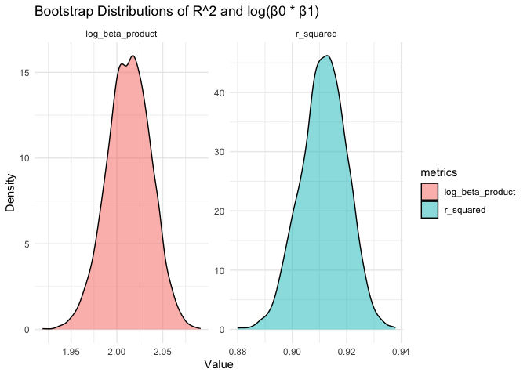
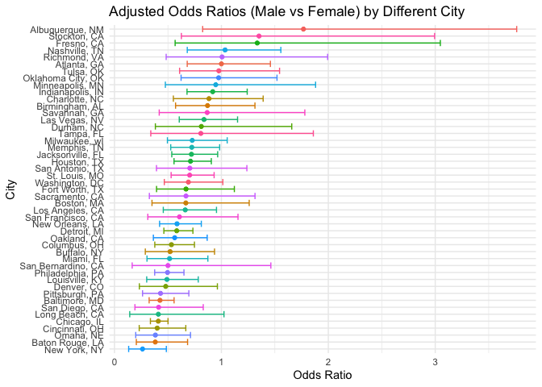
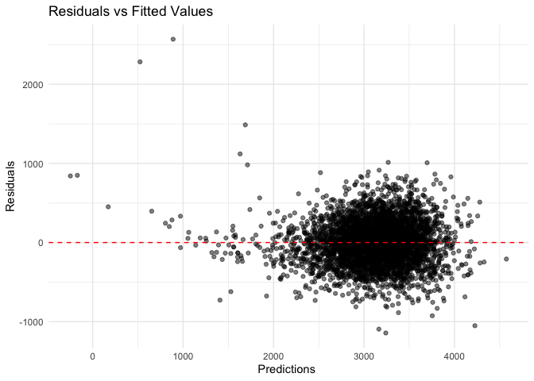
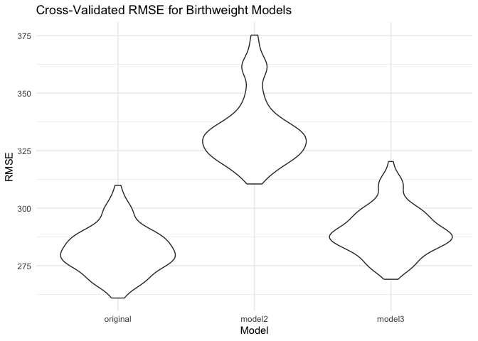

p8105_hw6_xw3038
================
Avery Wang
2024-12-01

Load the packages

``` r
library(tidyverse)
```

    ## ── Attaching core tidyverse packages ──────────────────────── tidyverse 2.0.0 ──
    ## ✔ dplyr     1.1.4     ✔ readr     2.1.5
    ## ✔ forcats   1.0.0     ✔ stringr   1.5.1
    ## ✔ ggplot2   3.5.1     ✔ tibble    3.2.1
    ## ✔ lubridate 1.9.3     ✔ tidyr     1.3.1
    ## ✔ purrr     1.0.2     
    ## ── Conflicts ────────────────────────────────────────── tidyverse_conflicts() ──
    ## ✖ dplyr::filter() masks stats::filter()
    ## ✖ dplyr::lag()    masks stats::lag()
    ## ℹ Use the conflicted package (<http://conflicted.r-lib.org/>) to force all conflicts to become errors

``` r
library(broom)
library(purrr)
library(modelr)
```

    ## 
    ## Attaching package: 'modelr'
    ## 
    ## The following object is masked from 'package:broom':
    ## 
    ##     bootstrap

``` r
library(rnoaa)
```

    ## The rnoaa package will soon be retired and archived because the underlying APIs have changed dramatically. The package currently works but does not pull the most recent data in all cases. A noaaWeather package is planned as a replacement but the functions will not be interchangeable.

``` r
set.seed(123)
```

## Problem 1

``` r
library(p8105.datasets)
weather_df = 
  rnoaa::meteo_pull_monitors(
    c("USW00094728"),
    var = c("PRCP", "TMIN", "TMAX"), 
    date_min = "2017-01-01",
    date_max = "2017-12-31") %>%
  mutate(
    name = recode(id, USW00094728 = "CentralPark_NY"),
    tmin = tmin / 10,
    tmax = tmax / 10) %>%
  select(name, id, everything())
```

    ## using cached file: /Users/xikunwang/Library/Caches/org.R-project.R/R/rnoaa/noaa_ghcnd/USW00094728.dly

    ## date created (size, mb): 2024-12-03 08:16:40.372894 (8.667)

    ## file min/max dates: 1869-01-01 / 2024-11-30

- Define bootstrap resampling function

``` r
boot_sample = function(df) {
  sample_frac(df, replace = TRUE)
}
boot_straps = 
  tibble(strap_number = 1:5000) |> 
  mutate(
    strap_sample = map(strap_number,\(i) boot_sample(df = weather_df))
  )

boot_straps
```

    ## # A tibble: 5,000 × 2
    ##    strap_number strap_sample      
    ##           <int> <list>            
    ##  1            1 <tibble [365 × 6]>
    ##  2            2 <tibble [365 × 6]>
    ##  3            3 <tibble [365 × 6]>
    ##  4            4 <tibble [365 × 6]>
    ##  5            5 <tibble [365 × 6]>
    ##  6            6 <tibble [365 × 6]>
    ##  7            7 <tibble [365 × 6]>
    ##  8            8 <tibble [365 × 6]>
    ##  9            9 <tibble [365 × 6]>
    ## 10           10 <tibble [365 × 6]>
    ## # ℹ 4,990 more rows

- For each bootstrap sample, a linear regression model is fit to predict
  tmax based on tmin.

``` r
boot_straps=boot_straps |> 
  mutate(
    strap_model = map(strap_sample, \(df) lm(tmax ~ tmin, data = df)), 
    result = map(strap_model, \(mod) {
      # Extract R^2 and log(β0 * β1)
      r_squared=glance(mod)$r.squared
      coefficients=tidy(mod)|>filter(term %in% c("(Intercept)", "tmin")) |> pull(estimate)
      log_beta_product=log(coefficients[1] * coefficients[2])
      tibble(r_squared,log_beta_product)
    })
  )|> select(-strap_sample, -strap_model)|>
  unnest(result)

boot_straps
```

    ## # A tibble: 5,000 × 3
    ##    strap_number r_squared log_beta_product
    ##           <int>     <dbl>            <dbl>
    ##  1            1     0.909             2.06
    ##  2            2     0.905             2.02
    ##  3            3     0.925             1.99
    ##  4            4     0.908             2.04
    ##  5            5     0.918             2.07
    ##  6            6     0.924             2.00
    ##  7            7     0.910             1.98
    ##  8            8     0.919             2.02
    ##  9            9     0.917             2.00
    ## 10           10     0.909             2.02
    ## # ℹ 4,990 more rows

- Plot distribution of the Estimate

``` r
boot_straps_longer=boot_straps |> 
  pivot_longer(cols = c(r_squared, log_beta_product), 
               names_to = "metrics", values_to = "value") 
boot_straps_longer|>
  ggplot(aes(x = value, fill = metrics)) +
  geom_density(alpha = 0.5) +
  facet_wrap(~metrics, scales = "free") +
  labs(
    title = "Bootstrap Distributions of R^2 and log(β0 * β1)",
    x = "Value",
    y = "Density"
  ) +
  theme_minimal()
```

<!-- -->

For the distribution of the log product, it us centered around 2, also
showing the low variability across the bootstrap sample. The
distribution of r-squared is also centered around 0.91. The high and
consistent R-squared values also suggest that the model effectively
explains a significant proportion of the variation in tmax across
bootstrap samples.

- Calculate CI for these two

``` r
# Calculate 95% confidence intervals
bootstrap_CI=boot_straps |> 
  summarise(
    r_squared_lower = quantile(r_squared, 0.025),
    r_squared_upper = quantile(r_squared, 0.975),
    log_beta_product_lower = quantile(log_beta_product, 0.025),
    log_beta_product_upper = quantile(log_beta_product, 0.975)
  )

print(bootstrap_CI)
```

    ## # A tibble: 1 × 4
    ##   r_squared_lower r_squared_upper log_beta_product_lower log_beta_product_upper
    ##             <dbl>           <dbl>                  <dbl>                  <dbl>
    ## 1           0.895           0.927                   1.96                   2.06

The CI for R^2 is around \[0.89, 0.93\]. And CI for log beta product is
\[1.96, 2.06\].

## Problem 2

- Load and Clean the data

``` r
homicide=read_csv(file = "./data/homicide-data.csv", 
                  na = c(".", "NA", "Unknown")) |>
  janitor::clean_names()
```

    ## Warning: One or more parsing issues, call `problems()` on your data frame for details,
    ## e.g.:
    ##   dat <- vroom(...)
    ##   problems(dat)

    ## Rows: 52179 Columns: 12
    ## ── Column specification ────────────────────────────────────────────────────────
    ## Delimiter: ","
    ## chr (8): uid, victim_last, victim_first, victim_race, victim_sex, city, stat...
    ## dbl (4): reported_date, victim_age, lat, lon
    ## 
    ## ℹ Use `spec()` to retrieve the full column specification for this data.
    ## ℹ Specify the column types or set `show_col_types = FALSE` to quiet this message.

``` r
homicide_cleaned =homicide |>
  mutate(
    city_state=paste(city, state, sep = ", "),
    is_solved=if_else(disposition=="Closed by arrest", 1, 0),
    victim_age=as.numeric(victim_age),
    victim_race=as.factor(victim_race),
    victim_sex=as.factor(victim_sex)
  ) |>
  # Exclude specific cities and limit analysis to specified victim races
  filter(
    !(city_state %in% c("Dallas, TX", "Phoenix, AZ", "Kansas City, MO", 
                        "Tulsa, AL")) &
      victim_race %in% c("White", "Black"),
    !is.na(victim_sex), !is.na(victim_age), !is.na(victim_race), 
    !is.na(is_solved)
  )
```

- Extract the adjusted odds ratio (and CI) for solving homicides
  comparing male victims to female victims

``` r
baltimore_data=homicide_cleaned |>
  filter(city_state=="Baltimore, MD")
glm_model=glm(
  is_solved ~ victim_age + victim_sex + victim_race,
  family = binomial(link = "logit"),
  data = baltimore_data
)

glm_summary_odds=broom::tidy(glm_model,conf.int = TRUE, exponentiate = TRUE)
glm_summary_odds
```

    ## # A tibble: 4 × 7
    ##   term             estimate std.error statistic  p.value conf.low conf.high
    ##   <chr>               <dbl>     <dbl>     <dbl>    <dbl>    <dbl>     <dbl>
    ## 1 (Intercept)         1.36    0.171        1.81 7.04e- 2    0.976     1.91 
    ## 2 victim_age          0.993   0.00332     -2.02 4.30e- 2    0.987     1.00 
    ## 3 victim_sexMale      0.426   0.138       -6.18 6.26e-10    0.324     0.558
    ## 4 victim_raceWhite    2.32    0.175        4.82 1.45e- 6    1.65      3.28

``` r
male_adjusted_odds=glm_summary_odds|>
  filter(term == "victim_sexMale")|>
  select(term, estimate, conf.low, conf.high)
# View the result
print(male_adjusted_odds)
```

    ## # A tibble: 1 × 4
    ##   term           estimate conf.low conf.high
    ##   <chr>             <dbl>    <dbl>     <dbl>
    ## 1 victim_sexMale    0.426    0.324     0.558

- Run glm for each of the cities in your dataset, and extract the
  adjusted odds ratio (and CI) for solving homicides comparing male
  victims to female victims.

``` r
city_glm=homicide_cleaned|>
  group_by(city_state)|>
  nest()|>
  #add model for each city
  mutate(glm_model=map(data, \(df) glm(is_solved ~ victim_age + 
                                         victim_sex + victim_race, 
                                family = binomial(link = "logit"), 
                                data = df)),
         result=map(glm_model, \(model) broom::tidy(model, 
                                                    conf.int = TRUE, 
                                                    exponentiate = TRUE)))|>
  select(-data,-glm_model)|>
  unnest(result)
```

``` r
male_city_glm=city_glm|>
  filter(term == "victim_sexMale") |>
  select(city_state, estimate, conf.low, conf.high)
male_city_glm
```

    ## # A tibble: 47 × 4
    ## # Groups:   city_state [47]
    ##    city_state      estimate conf.low conf.high
    ##    <chr>              <dbl>    <dbl>     <dbl>
    ##  1 Albuquerque, NM    1.77     0.825     3.76 
    ##  2 Atlanta, GA        1.00     0.680     1.46 
    ##  3 Baltimore, MD      0.426    0.324     0.558
    ##  4 Baton Rouge, LA    0.381    0.204     0.684
    ##  5 Birmingham, AL     0.870    0.571     1.31 
    ##  6 Boston, MA         0.667    0.351     1.26 
    ##  7 Buffalo, NY        0.521    0.288     0.936
    ##  8 Charlotte, NC      0.884    0.551     1.39 
    ##  9 Chicago, IL        0.410    0.336     0.501
    ## 10 Cincinnati, OH     0.400    0.231     0.667
    ## # ℹ 37 more rows

- Create a plot that shows the estimated ORs and CIs for each city.
  Organize cities according to estimated OR, and comment on the plot.

``` r
city_results_arrange=male_city_glm|>
  arrange(estimate)|>
  mutate(city_state = factor(city_state, levels = city_state))
city_results_arrange
```

    ## # A tibble: 47 × 4
    ## # Groups:   city_state [47]
    ##    city_state      estimate conf.low conf.high
    ##    <fct>              <dbl>    <dbl>     <dbl>
    ##  1 New York, NY       0.262    0.133     0.485
    ##  2 Baton Rouge, LA    0.381    0.204     0.684
    ##  3 Omaha, NE          0.382    0.199     0.711
    ##  4 Cincinnati, OH     0.400    0.231     0.667
    ##  5 Chicago, IL        0.410    0.336     0.501
    ##  6 Long Beach, CA     0.410    0.143     1.02 
    ##  7 San Diego, CA      0.413    0.191     0.830
    ##  8 Baltimore, MD      0.426    0.324     0.558
    ##  9 Pittsburgh, PA     0.431    0.263     0.696
    ## 10 Denver, CO         0.479    0.233     0.962
    ## # ℹ 37 more rows

``` r
city_results_arrange|>ggplot(aes(x=reorder(city_state, estimate), y = estimate, 
                                 color=city_state)) +
  geom_point() +
  geom_errorbar(aes(ymin = conf.low, ymax = conf.high)) +
  coord_flip() + 
  labs(
    title = "Adjusted Odds Ratios (Male vs Female) by Different City",
    x = "City",
    y = "Odds Ratio"
  ) +
  theme_minimal()+ 
  theme(legend.position = "none")
```

<!-- -->

Cities with OR \> 1 (such as Stockton, CA; Albuquerque, NM) show the
cases involving male victims are more likely to be solved than those
involving female victims. And the majority cities have OR less than 1.
Some cities, like Stockton, CA and Albuquerque, NM, have wide CIs,
indicating high variability and uncertainty. Narrower CIs in cities like
Chicago, IL also suggest more reliable estimates.

## Problem 3

``` r
birthweight=read_csv(file = "./data/birthweight.csv", 
                     na = c(".", "NA", "Unknown")) |>
  janitor::clean_names()
```

    ## Rows: 4342 Columns: 20
    ## ── Column specification ────────────────────────────────────────────────────────
    ## Delimiter: ","
    ## dbl (20): babysex, bhead, blength, bwt, delwt, fincome, frace, gaweeks, malf...
    ## 
    ## ℹ Use `spec()` to retrieve the full column specification for this data.
    ## ℹ Specify the column types or set `show_col_types = FALSE` to quiet this message.

- Load and clean the data for regression analysis

``` r
birthweight_cleaned=birthweight|>
  mutate( 
    babysex = factor(babysex, levels = c(1, 2), labels = c("Male", "Female")),
    frace = factor(frace, levels = c(1, 2, 3, 4, 8, 9), 
                   labels = c("White", "Black", "Asian", 
                              "Puerto Rican", "Other", "Unknown")),
    mrace = factor(mrace, levels = c(1, 2, 3, 4, 8), 
                   labels = c("White", "Black", "Asian", 
                              "Puerto Rican", "Other")),
    malform = factor(malform, levels = c(0, 1), 
                     labels = c("Absent", "Present")),
    fincome = fincome * 100
  )|>
  drop_na()
```

- Propose a regression model for birthweight

``` r
birthweight_model=lm(
  bwt ~ babysex + blength + bhead + momage + mheight + ppbmi +
    smoken + wtgain + menarche+ fincome,
  data = birthweight_cleaned
)
birthweight_model
```

    ## 
    ## Call:
    ## lm(formula = bwt ~ babysex + blength + bhead + momage + mheight + 
    ##     ppbmi + smoken + wtgain + menarche + fincome, data = birthweight_cleaned)
    ## 
    ## Coefficients:
    ##   (Intercept)  babysexFemale        blength          bhead         momage  
    ##    -6687.3367        38.5379        80.2457       140.4947         5.4761  
    ##       mheight          ppbmi         smoken         wtgain       menarche  
    ##       12.0728         5.8623        -2.5017         4.2621        -5.7271  
    ##       fincome  
    ##        0.0106

The goal is to predic the baby’s birthweight (`bwt`) assuming that the
birthweight is influenced by: Baby’s Physical Characteristics:
`babysex`, `blength`, `bhead`. Maternal Characteristics: `momage`,
`mheight`, `ppbmi`, `smoken`, `wtgain`, `menarche`. Family condition as
the sociaeconomic consideration: `fincome`.

``` r
birthweight_cleaned |>
  add_predictions(birthweight_model) |>
  add_residuals(birthweight_model)|>
  ggplot( aes(x = pred, y = resid)) +
  geom_point(alpha = 0.5) +
  geom_hline(yintercept = 0, linetype = "dashed",color="red") +
  labs(
    title = "Residuals vs Fitted Values",
    x = "Predictions ",
    y = "Residuals"
  ) +
  theme_minimal()
```

<!-- -->

- Compare with the other two models

``` r
model2=lm(bwt ~blength + gaweeks, data = birthweight_cleaned)
model3=lm(bwt~ bhead * blength * babysex, data = birthweight_cleaned)
```

``` r
cv_df = crossv_mc(birthweight_cleaned, 100) |>
  mutate(
    train = map(train, as_tibble),
    test = map(test, as_tibble)
)

cv_df=cv_df |> 
  mutate(
    # Define and fit models
    original_mod = map(train, \(df) lm(bwt ~babysex + blength + bhead + 
                  momage + mheight + ppbmi +
                  smoken + wtgain + menarche+ fincome, 
                  data = df)),
    model2_mod = map(train, \(df) lm(bwt ~ blength + gaweeks, data = df)),
    model3_mod = map(train, \(df) lm(bwt ~ bhead * blength * babysex, data = df))
  )|>
  mutate(
    # Calculate RMSE for each model on the test sets
    rmse_original = map2_dbl(original_mod, test, \(mod, df) rmse(model = mod, 
                                                                 data = df)),
    rmse_model2 = map2_dbl(model2_mod, test, \(mod, df) rmse(model = mod, 
                                                             data = df)),
    rmse_model3 = map2_dbl(model3_mod, test, \(mod, df) rmse(model = mod, 
                                                             data = df))
  )
```

``` r
summary_results=cv_df |> 
  summarise(
    mean_rmse_original = mean(rmse_original),
    mean_rmse_model2 = mean(rmse_model2),
    mean_rmse_model3 = mean(rmse_model3)
  )

print(summary_results)
```

    ## # A tibble: 1 × 3
    ##   mean_rmse_original mean_rmse_model2 mean_rmse_model3
    ##                <dbl>            <dbl>            <dbl>
    ## 1               282.             334.             290.

``` r
cv_long=cv_df |> select(starts_with("rmse"))|>
  pivot_longer(
    everything(),
    names_to = "model", 
    values_to = "rmse",
    names_prefix = "rmse_") |> 
  mutate(model = fct_inorder(model))
```

``` r
 cv_long|>ggplot(aes(x = model, y = rmse)) + 
   geom_violin()+
  labs(
    title = "Cross-Validated RMSE for Birthweight Models",
    x = "Model",
    y = "RMSE"
  ) +
  theme_minimal()
```

<!-- -->

The original hypothesized model seems to have the best performance, with
relatively the best accuracy. The model with the main effect shows the
highest rmse, indicating it performs worse. And the model three-way
interaction performs slightly better but still wors than the orginial
hypothesized model
