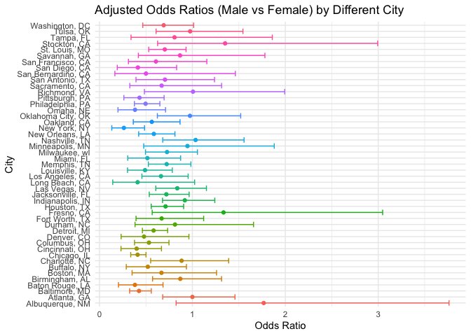

p8105_hw6_xw3038
================
Avery Wang
2024-12-01

Load the packages

``` r
library(tidyverse)
```

    ## ── Attaching core tidyverse packages ──────────────────────── tidyverse 2.0.0 ──
    ## ✔ dplyr     1.1.4     ✔ readr     2.1.5
    ## ✔ forcats   1.0.0     ✔ stringr   1.5.1
    ## ✔ ggplot2   3.5.1     ✔ tibble    3.2.1
    ## ✔ lubridate 1.9.3     ✔ tidyr     1.3.1
    ## ✔ purrr     1.0.2     
    ## ── Conflicts ────────────────────────────────────────── tidyverse_conflicts() ──
    ## ✖ dplyr::filter() masks stats::filter()
    ## ✖ dplyr::lag()    masks stats::lag()
    ## ℹ Use the conflicted package (<http://conflicted.r-lib.org/>) to force all conflicts to become errors

``` r
library(broom)
library(purrr)
library(rnoaa)
```

    ## The rnoaa package will soon be retired and archived because the underlying APIs have changed dramatically. The package currently works but does not pull the most recent data in all cases. A noaaWeather package is planned as a replacement but the functions will not be interchangeable.

## Problem 2

- Load and Clean the data

``` r
homicide=read_csv(file = "./data/homicide-data.csv", na = c(".", "NA", "Unknown")) |>
  janitor::clean_names()
```

    ## Warning: One or more parsing issues, call `problems()` on your data frame for details,
    ## e.g.:
    ##   dat <- vroom(...)
    ##   problems(dat)

    ## Rows: 52179 Columns: 12
    ## ── Column specification ────────────────────────────────────────────────────────
    ## Delimiter: ","
    ## chr (8): uid, victim_last, victim_first, victim_race, victim_sex, city, stat...
    ## dbl (4): reported_date, victim_age, lat, lon
    ## 
    ## ℹ Use `spec()` to retrieve the full column specification for this data.
    ## ℹ Specify the column types or set `show_col_types = FALSE` to quiet this message.

``` r
homicide_cleaned =homicide |>
  mutate(
    city_state=paste(city, state, sep = ", "),
    is_solved=if_else(disposition=="Closed by arrest", 1, 0),
    victim_age=as.numeric(victim_age),
    victim_race=as.factor(victim_race),
    victim_sex=as.factor(victim_sex)
  ) |>
  # Exclude specific cities and limit analysis to specified victim races
  filter(
    !(city_state %in% c("Dallas, TX", "Phoenix, AZ", "Kansas City, MO", "Tulsa, AL")) &
      victim_race %in% c("White", "Black"),
    !is.na(victim_sex), !is.na(victim_age), !is.na(victim_race), !is.na(is_solved)
  )
```

- Extract the adjusted odds ratio (and CI) for solving homicides
  comparing male victims to female victims

``` r
baltimore_data=homicide_cleaned |>
  filter(city_state=="Baltimore, MD")
logistic_model=glm_model=glm(
  is_solved ~ victim_age + victim_sex + victim_race,
  family = binomial(link = "logit"),
  data = baltimore_data
)

glm_summary_odds=broom::tidy(glm_model,conf.int = TRUE, exponentiate = TRUE)
glm_summary_odds
```

    ## # A tibble: 4 × 7
    ##   term             estimate std.error statistic  p.value conf.low conf.high
    ##   <chr>               <dbl>     <dbl>     <dbl>    <dbl>    <dbl>     <dbl>
    ## 1 (Intercept)         1.36    0.171        1.81 7.04e- 2    0.976     1.91 
    ## 2 victim_age          0.993   0.00332     -2.02 4.30e- 2    0.987     1.00 
    ## 3 victim_sexMale      0.426   0.138       -6.18 6.26e-10    0.324     0.558
    ## 4 victim_raceWhite    2.32    0.175        4.82 1.45e- 6    1.65      3.28

``` r
male_adjusted_odds=glm_summary_odds|>
  filter(term == "victim_sexMale")|>
  select(term, estimate, conf.low, conf.high)
# View the result
print(male_adjusted_odds)
```

    ## # A tibble: 1 × 4
    ##   term           estimate conf.low conf.high
    ##   <chr>             <dbl>    <dbl>     <dbl>
    ## 1 victim_sexMale    0.426    0.324     0.558

- Run glm for each of the cities in your dataset, and extract the
  adjusted odds ratio (and CI) for solving homicides comparing male
  victims to female victims.

``` r
city_glm=homicide_cleaned|>
  group_by(city_state)|>
  nest()|>
  #add model for each city
  mutate(glm_model=map(data, \(df) glm(is_solved ~ victim_age + victim_sex + victim_race, 
                                family = binomial(link = "logit"), 
                                data = df)),
         result=map(glm_model, \(model) broom::tidy(model, 
                                                    conf.int = TRUE, 
                                                    exponentiate = TRUE)))|>
  select(-data,-glm_model)|>
  unnest(result)
```

``` r
male_city_glm=city_glm|>
  filter(term == "victim_sexMale") |>
  select(city_state, estimate, conf.low, conf.high)
male_city_glm
```

    ## # A tibble: 47 × 4
    ## # Groups:   city_state [47]
    ##    city_state      estimate conf.low conf.high
    ##    <chr>              <dbl>    <dbl>     <dbl>
    ##  1 Albuquerque, NM    1.77     0.825     3.76 
    ##  2 Atlanta, GA        1.00     0.680     1.46 
    ##  3 Baltimore, MD      0.426    0.324     0.558
    ##  4 Baton Rouge, LA    0.381    0.204     0.684
    ##  5 Birmingham, AL     0.870    0.571     1.31 
    ##  6 Boston, MA         0.667    0.351     1.26 
    ##  7 Buffalo, NY        0.521    0.288     0.936
    ##  8 Charlotte, NC      0.884    0.551     1.39 
    ##  9 Chicago, IL        0.410    0.336     0.501
    ## 10 Cincinnati, OH     0.400    0.231     0.667
    ## # ℹ 37 more rows

- Create a plot that shows the estimated ORs and CIs for each city.
  Organize cities according to estimated OR, and comment on the plot.

``` r
city_results_arrange=male_city_glm|>
  arrange(estimate)|>
  mutate(city_state = as.factor(city_state))
city_results_arrange
```

    ## # A tibble: 47 × 4
    ## # Groups:   city_state [47]
    ##    city_state      estimate conf.low conf.high
    ##    <fct>              <dbl>    <dbl>     <dbl>
    ##  1 New York, NY       0.262    0.133     0.485
    ##  2 Baton Rouge, LA    0.381    0.204     0.684
    ##  3 Omaha, NE          0.382    0.199     0.711
    ##  4 Cincinnati, OH     0.400    0.231     0.667
    ##  5 Chicago, IL        0.410    0.336     0.501
    ##  6 Long Beach, CA     0.410    0.143     1.02 
    ##  7 San Diego, CA      0.413    0.191     0.830
    ##  8 Baltimore, MD      0.426    0.324     0.558
    ##  9 Pittsburgh, PA     0.431    0.263     0.696
    ## 10 Denver, CO         0.479    0.233     0.962
    ## # ℹ 37 more rows

``` r
city_results_arrange|>ggplot(aes(x = city_state, y = estimate,color=city_state)) +
  geom_point() +
  geom_errorbar(aes(ymin = conf.low, ymax = conf.high)) +
  coord_flip() + 
  labs(
    title = "Adjusted Odds Ratios (Male vs Female) by Different City",
    x = "City",
    y = "Odds Ratio"
  ) +
  theme_minimal()+ 
  theme(legend.position = "none")
```

<!-- -->
